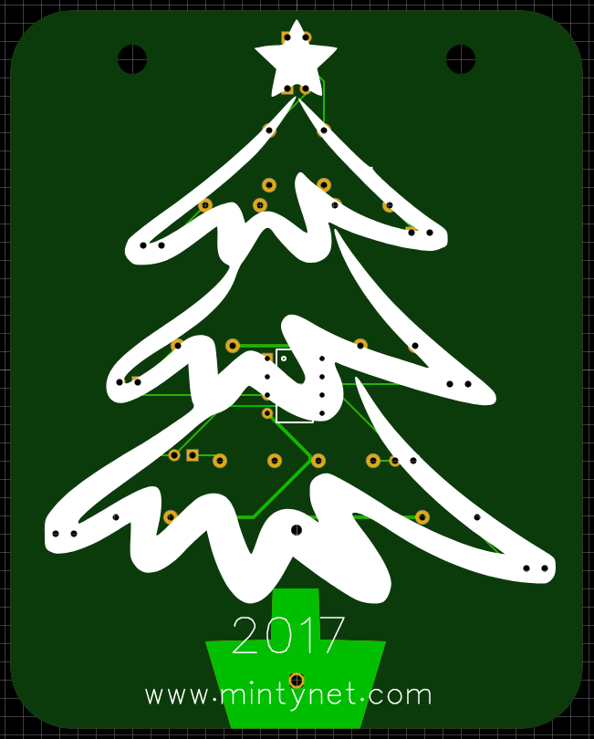

# Christmas
Attiny85 based led Christmas ornaments, schematics and gerbers were produced using https://www.easyeda.com and pcbs were ordered from https://jlcpcb.com

 2021 Snow flake with 12 charlieplexed leds, uses ATTINY85-20SU on add on board which is programmed using ICSP usbasp, can be powered by usb micro or CR2032.
 
 
 
 
 
 
 2020 Candy Cane with 5 WS2812b Neopixels, uses ATTINY85-20SU on add on board which is programmed using ICSP usbasp, can be powered by usb micro or CR2032.
       Can be cascaded to more and run off a single MCU
 
 
 
 
 
 
 2019 Shooting Star with 5 WS2812b Neopixels, uses ATTINY85-20SU, powered by CR2032
 
 
 
 2018 Snowman with 1 WS2812b Neopixels, 4 charlieplexed leds, uses ATTINY85-20SU, powered by CR2032
 
 
 
 2017 Christmas tree with 10 charlieplexed leds, uses ATTINY85-20PU, powered by CR2032
 
 
 
  The ATTINY85-20SU can be swapped for the ATTINY45-20SU
